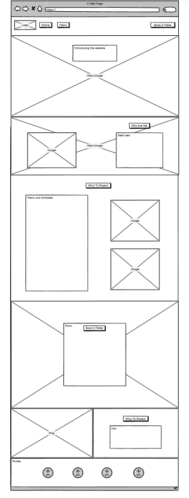
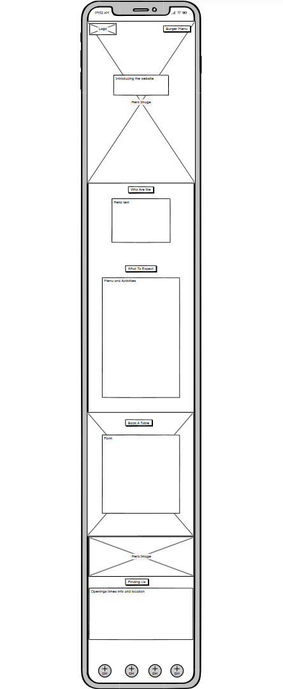
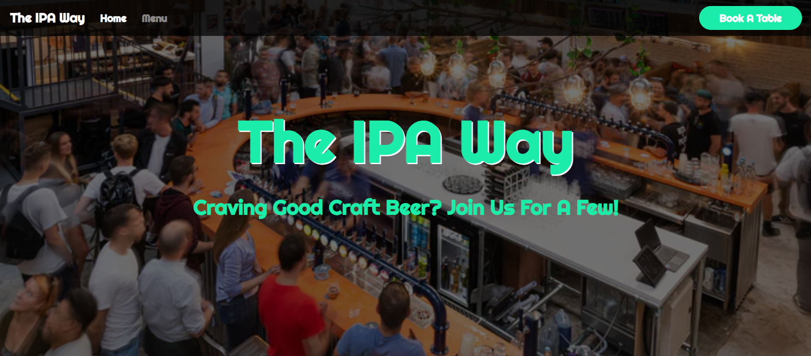
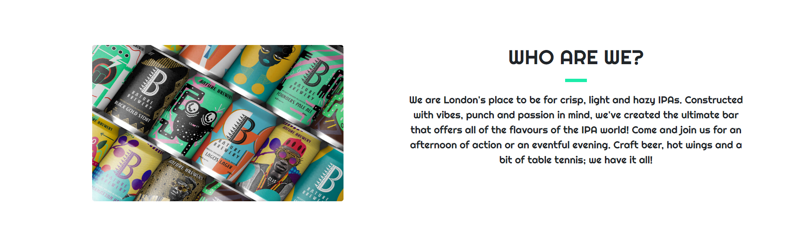
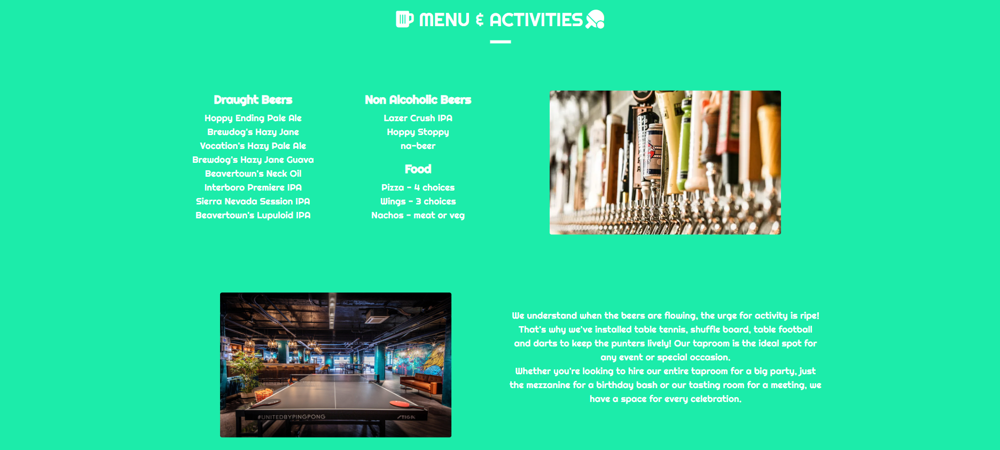
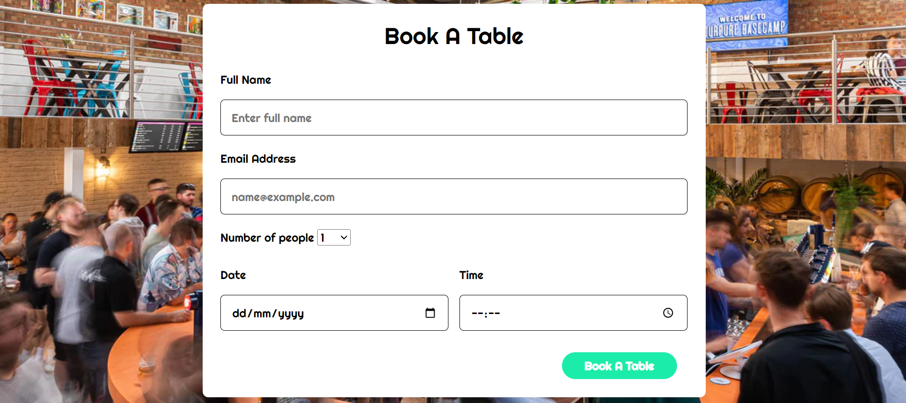
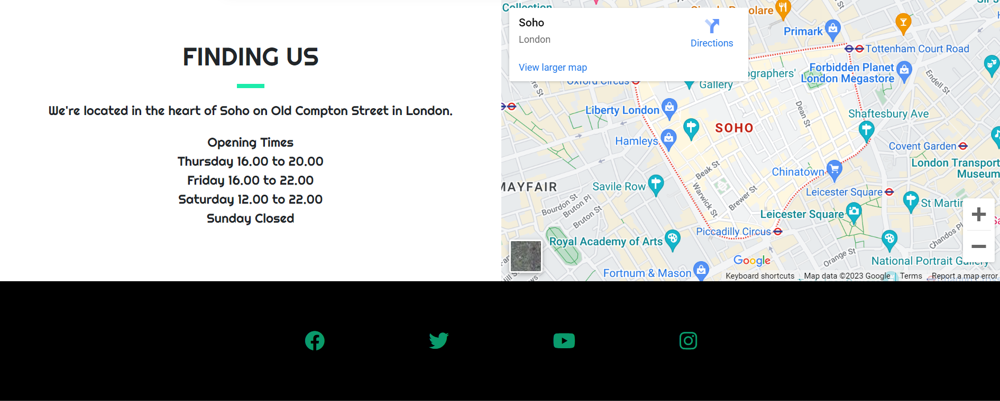
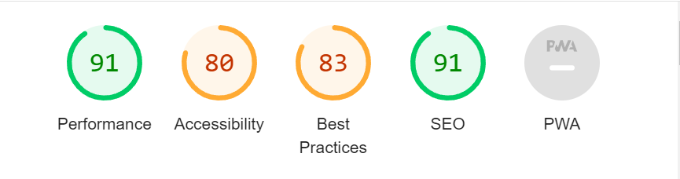

# The IPA Way

### The IPA Way is a crafted Indian Pale Ale business created to contiue the IPA movement across the globe. This website has been created to detail the look, the menu and the location of the new bar that has opened in London.
### The home page offers an overall feel and vibe to the company and what should be expected when you visit the the bar. The menu page gives the website visitor a clear idea of the drinks that will be on offer and some food selections as well. The book page has information around the opening times, ytable booking form and Google Maps location finder.

My live site is here - https://ollie-herridge10.github.io/Project1/

# Site Owner Goals

* A site made with the IPA industry in mind that pops with unique colours and ease of use.
* Friendly navigation to easily find out what you can drink, eat and do at the bar and find out where it's located.
* An easy booking system highlighted with a vibrant button to be able to book a table within the opening hours shown.

# Customer Experience

* I wanted the customer to feel like they are welcomed to the world of IPAs but can instantly tell that this is a bar and not a place to buy products.
* The easy navigation and scroll through each part of the website is highlighted with bold headings explaing what each part of the website means.
* First time visiters to the websites get a clear indication of who we are, what happens at our bar, where is it and when it's open.
* Reoccuring visitors who come to book a table get that ease of use as the button take them straight to the form.

# Design

### Images
* The images I have incorporated into my website give a real feel of what to expect when you arrive at the bar. The two big hero images show real detail into what the bar looks like and gives off the vibe of the place as well. The smaller images I have portray the finer details about my bar including the fun and games you can have there.

### Fonts
* I chose the Righteous font for my website as I believe it carries the weight of the IPA industry with it. The indsutry is fun and playful so I thought Righteous had the right tone.

### Colours
* Cyan, black and white were the chosen colours for my website. The colour rgb(28, 236, 170) popped right off the page and gave my website a theme that I could continue with to carry on that playful sense that my website offers.

# Wirefames
Wireframes were produced using Balsamiq. 

 

 
Desktop Wireframe

 

 

    
Mobile Wireframe

 

# Features
### Home Page
* Fully responsive navigation bar, buttons, hero image and text.
* Nav icons collapse to a burger menu on the right hand side.
* Hero image is stuck which gives the nice scroll effect and also has a black opaque background cover which dims the hero image to make sure the title text pops with it's text shadow.
* Hero image itself gives off the full effect of what to expect from the bar.
* Book a table button connects to the booking section of the page.

### Who Are We Page
* Fully responsive short section of the website that pops with good colour and meaningful text.
* Image disappears when the screen goes to small.
* Header is underlines with a block divider.
* Text introduces the brand.

### Menu Page
* Fully responsive menu and activities page that gives good indication to the drinks and food supplied and the actvities that the bar has such as table tennis and so on.
* Two images that show the table tennis and the draught pumps to the variety of beers on offer.
* Draught image disappears on a medium screen, the table tennis image remains and then disappears on a small screen.
* Activities text centers on a smaller screen once both images has disapearred.
* The menu is made up of two unordered lists with headers.
* The background conitinues the bluey/green colour theme that gives the website that playful vibe.

### Booking Page
* Fully responsive background image and form for booking a table at the bar.
* Background image again remains stuck in place for a nice scrolling effect.
* Form has a white background, curved edges, black border for the input boxes and the same button as in the home page.
* There are two text boxes, one select box for the number of people, one date and one time input on the form as well as the button.
* All parts of the form are required to be filled in before submitting.
* Button takes you through to a new tab which confirms your booking.

### Finding Us & Footer Page
* Fully responsive section of the page which when seen on a smaller screen, the google image slides below the Finding Us column which gives that area a nice chronilogical feel.
* Again, the bloack divider and Righteous text on the white background is very bold and easily tells you info regarding the opening times.
* Google map implemented which shrinks and expands depending on it's place on the page.
* Footer has a bold black background and the social media icons are the bluey/green that you see run through the website.

# Testing
### Lighthouse
* Happy with this score, although the accessibility could have been a little better but it was to be expected with large and busy hero images and a bright bluey/green colour that I used.

### HTML
* Used https://validator.w3.org/nu/ repeatedly throughout the project.

### CSS 
* Used https://jigsaw.w3.org/css-validator/ repeatedly throughout the project.

### Form Testing
* The form has been tested to ensure it would not submit without the required input fields being filled in.

### Links Testing 
* All navigation links were tested manually to ensure the user is directed to the correct section of the website.
* Social Media links in the footer of each page were tested manually to ensure they direct the user to the correct page and open in a new tab.

# Bugs
* There was a very specific bug that I couldn't get my head around that was keeping me from making the form responsive. I soon learned that the container element I was using also corresponded with the above parts of the website in my styling. After some research and trial & error, I then switched the way I implemented the background image into the 'Book A Table' section. Following that I also scrapped my first form and implemented it again so that it was responsive on all screen sizes.

* My footer had a small white gap below it, I soon realised that I had styled the footer as a class and not just a normal element.

# Technologies Used
### Languages
* HTML
* CSS
* Bootstrap

### Frameworks - Libraries - Programs Used
* Responsinator - Used to verify responsiveness of website on different devices.
* Balsamiq - Used to generate Wireframe images.
* Chrome Dev Tools - Used for overall development and tweaking, including testing responsiveness and performance.
* Font Awesome - Used for Social Media icons in footer.
* GitHub - Used for version control and hosting.
* Google Fonts - Used to import and alter fonts on the page.
* TinyPNG - Used to compress images to reduce file size without a reduction in quality.
* W3C - Used for HTML & CSS Validation.

# Credits & Media
### Below are some of the sites and resources that inspired me to make this project.
* https://www.fourpure.com/pages/taproom-se16
* https://www.vocationbrewery.com/
* https://www.brewdog.com/uk

### Below are the links to each of the images I have in my project.
* Hero Image 1 - https://www.fourpure.com/cdn/shop/files/Fourpure_Taproom_Events_698x458.jpg?v=1670413433
* Hero Image 2 - https://www.fourpure.com/cdn/shop/files/40-day-placeholder_1220x512_crop_center.jpg?v=1649169548
* Beer Cans Image - https://www.baturebrewery.com/media/w12fgcmy/group_shot.jpg
* Draght Beer Image - https://www.indystar.com/gcdn/-mm-/a5076e7a43a0cec6129489319d0fb728e2cd1814/c=0-264-5184-3193/local/-/media/2015/12/29/Indianapolis/Indianapolis/635870074476103412-042-tap.JPG?width=660&height=373&fit=crop&format=pjpg&auto=webp
* Table Tennis Image - https://www.bostonmagazine.com/wp-content/uploads/sites/2/2021/11/spin-ping-pong-boston-t.jpg

### Below are some of the code resources that I used to help me and turned into my own.
* Whiskey Project by CodeInstitute - I used the hero image layout and navbar code from the code stored in GitHub on the Whiskey Project to help me get started with the my project although I have changed many elements in that section to give it my own feel. Some of the CSS styling including the styling to the navbar, hero image and buttons still remain whilst I have tweaked them to fit what I wanted to do.

# Acknowledgments
* I'd like to thank Antonio my mentor for his ideas and technical knitbits 
* I appreciate my tutor Komal for his teaching of HTML and CSS

